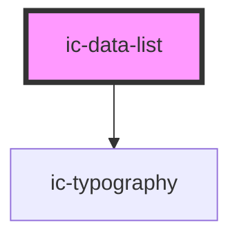

# ic-data-list

<!-- Auto Generated Below -->

## Properties

| Property  | Attribute | Description                                                   | Type      | Default     |
| --------- | --------- | ------------------------------------------------------------- | --------- | ----------- |
| `heading` | `heading` | Title for the data list                                       | `string`  | `undefined` |
| `small`   | `small`   | Set the data heading and all child data rows to small styling | `boolean` | `false`     |

## Dependencies

### Depends on

- [ic-typography](../ic-typography)

### Graph

----------------------------------------------

